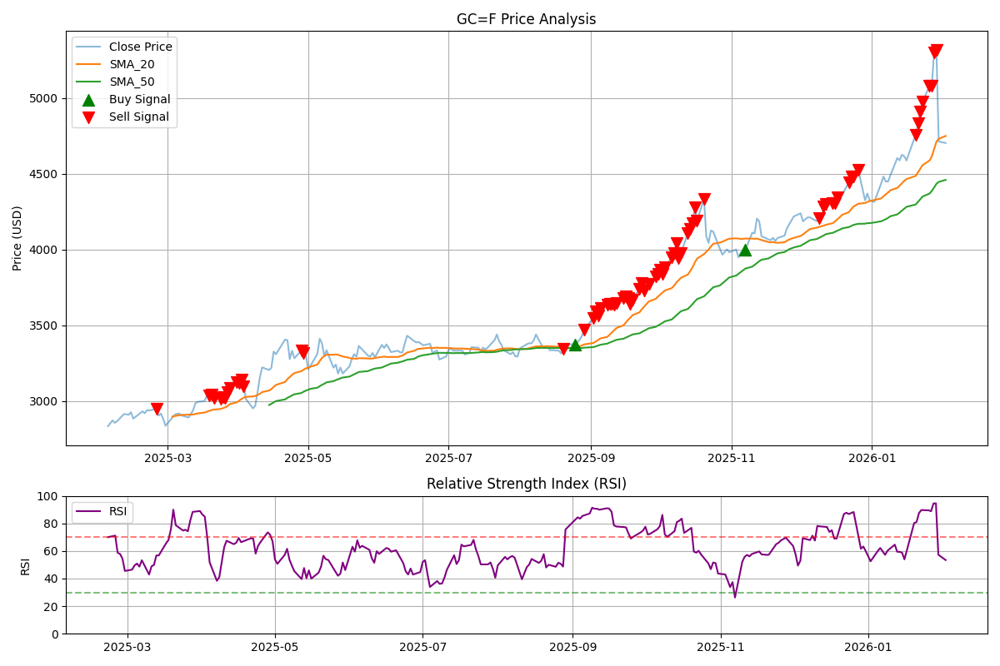
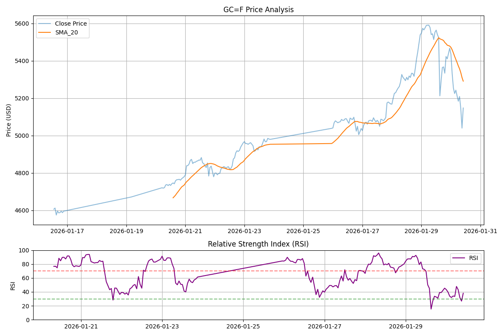
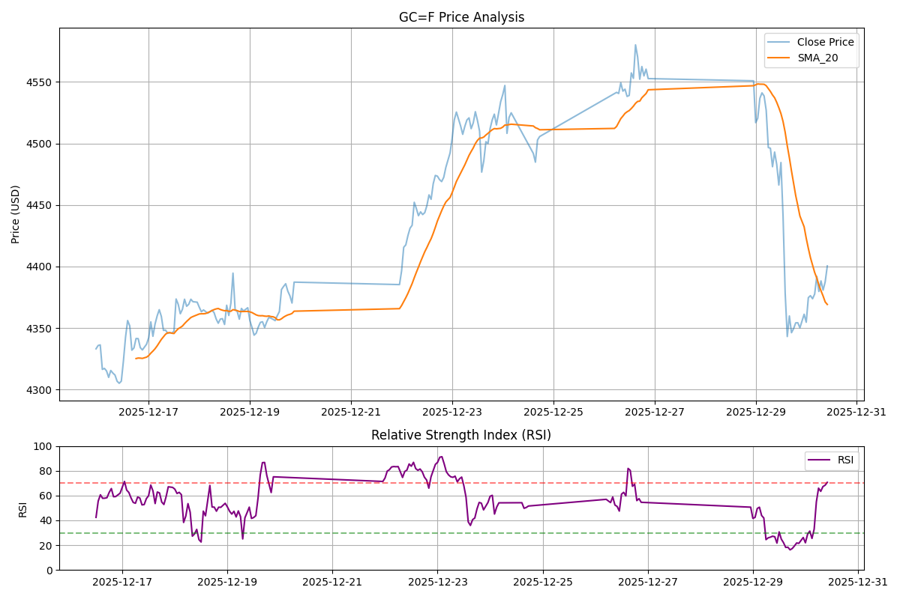

# Metal Analyzer

貴金属（ゴールド等）の市場価格を分析し、トレンド判定や特定のチャートパターン（ダブルトップ等）を検知するためのPythonライブラリです。

## 特徴

- **マルチタイムフレーム分析**: 日足と1時間足を組み合わせたトップダウン分析。
- **パターン検知**: SciPyを用いた高度なダブルトップ（Wトップ）検知。
- **モジュール構成**: 指標計算(`indicators`)、形状検知(`patterns`)、判定モデル(`models`)が独立。
- **データソース分離**: `yfinance` 等の外部ライブラリで取得したデータを、汎用的なPandas DataFrameとして受け取り可能。

## インストール

```bash
cd metal-analyzer
pip install .
```

## 分析シナリオと実行結果

本ライブラリには、主要な機能を試すための3つのデモスクリプトが含まれています。

### 1. 最新分析 (`examples/demo.py`)
現在の市場データを取得し、最新のトレンドを分析します。

#### サンプルコード
```python
import yfinance as yf
from metal_analyzer import MetalAnalyzer

ticker = "GC=F"
analyzer = MetalAnalyzer(ticker=ticker)

# データの外部取得
daily_data = yf.download(ticker, period="1y", interval="1d")
hourly_data = yf.download(ticker, period="1mo", interval="1h")

# 分析の実行
analyzer.set_data(daily_data)
analyzer.calculate_sma(20)
analyzer.calculate_rsi(14)
analyzer.set_multi_timeframe_data(daily_data, hourly_data)
analyzer.analyze_top_down()
```

#### 出力例


---

### 2. 2026年1月30日 暴落検知シミュレーション (`examples/demo-20260130.py`)
歴史的な急落が発生した際のシグナル発生状況を再現します。

#### 実行結果
```text
検知結果: [ALERT] ダブルトップを検知しました！ ピーク: 5591.00, 5467.60. ネックライン 5212.90 を下回ったため、売りシグナルです。
```

#### チャート画像


---

### 3. 2025年12月30日 シミュレーション (`examples/demo-20251230.py`)
急落直前の「パターン形成中」の状況（ネックラインをまだ割っていない状態）を再現します。

#### 実行結果
```text
ダブルトップ判定: パターン形成中ですが、ネックラインを割り込んでいません（ネックラインを下回ることで下降への転換が確定します）。
```

#### チャート画像


## プロジェクト構成

- `metal_analyzer/core/`: 基盤となる `MetalAnalyzer` クラス。
- `metal_analyzer/indicators/`: SMA, RSI 等の計算。
- `metal_analyzer/patterns/`: ダブルトップ等の形状検知。
- `metal_analyzer/models/`: トップダウン分析等の複合判定ロジック。
