# Metal Analyzer

A professional Python library for advanced analysis of precious metal prices (e.g., Gold). It provides high-precision trend prediction, market sentiment analysis, and sophisticated chart pattern detection.

## Key Features

Feature|Description
--|--
Advanced Trend Analysis|Predicts crashes and surges based on 4 key dimensions: Long-term Trend, Momentum, Volatility Acceleration, and Sentiment.
Multi-Timeframe Support|Generates 6 types of timeframe charts: Monthly, Weekly, Daily, 4H, 1H, and 15M. Visualizes trends with EMA 20/50/200 and Bollinger Bands.

## Installation

```bash
cd metal-analyzer
pip install .
```

## Quick Start: Using in Python Code

Beyond the demo scripts, you can build your own analysis flow by calling the library components directly.

```python
from metal_analyzer import MetalAnalyzer
import yfinance as yf

# 1. Initialize the Analyzer
analyzer = MetalAnalyzer(ticker="GC=F")

# 2. Fetch and Add Data (e.g., using Yahoo Finance)
daily_df = yf.download("GC=F", period="2y", interval="1d")
h1_df = yf.download("GC=F", period="2mo", interval="1h")

analyzer.add_timeframe_data("Daily", daily_df)
analyzer.add_timeframe_data("1h", h1_df)

# 3. Run Various Analysis Functions

# A. Advanced Trend Prediction (4 Dashboards)
result_adv = analyzer.analyze_advanced_trend()
print(f"Prediction: {result_adv['final_prediction']}")

# B. Top-Down Analysis (Combines Daily and 1H)
from metal_analyzer.models import analyze_top_down
td_res = analyze_top_down(daily_df, h1_df)
print(f"Top-Down View: {td_res['prediction']}")

# C. Chart Pattern Detection (Double Top)
detected, details = analyzer.detect_double_top()
if detected:
    print(f"Pattern Detected: {details}")

# D. Entry Signal Determination
from metal_analyzer.models import determine_entry_signals
signal = determine_entry_signals(h1_df)
print(f"Trade Signal: {signal} (1:Buy, -1:Sell, 0:Wait)")

# 4. Generate Charts
# EMA 20/50/200 and Bollinger Bands are automatically plotted
analyzer.plot_candlestick("1h", filename="my_analysis.png", title="Gold 1H Analysis")
```

---

## Usage: 3 Main Demos

Three demo scripts are provided in the `examples/` folder to showcase the library's capabilities.

### 1. Comprehensive Analysis Demo (`examples/demo.py`)
Generates charts for all major timeframes and runs advanced trend prediction using the latest market data.

#### Execution Result (Console Output)
```text
=== Metal Analyzer Comprehensive Analysis Demo ===
[1] Fetching data and generating charts...
[2] Advanced Trend Analysis
==================================================
 ■ High-Precision Gold Analysis Dashboard
==================================================
【Long Trend:  Neutral / Consolidation
【Momentum:    Strong Downward Pressure
【Volatility:  Stable
【Sentiment】   Range Bound
--------------------------------------------------
 Final Prediction: Continuation Caution
 Risk Level:       Medium
 Comment: Downward bias is strong, but a major acceleration (crash) hasn't triggered yet.
==================================================
```

#### Output Charts (6 Timeframes)
<details>
<summary>Click to view all timeframe charts (6 images)</summary>

- **Monthly**
  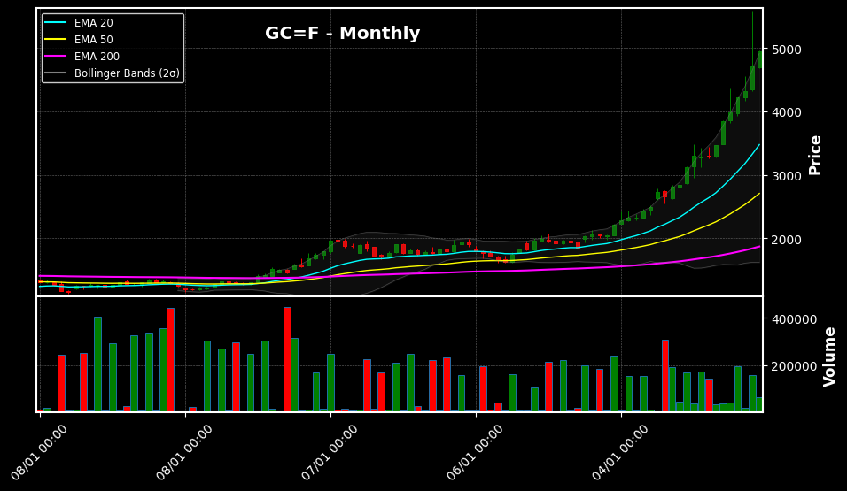
- **Weekly**
  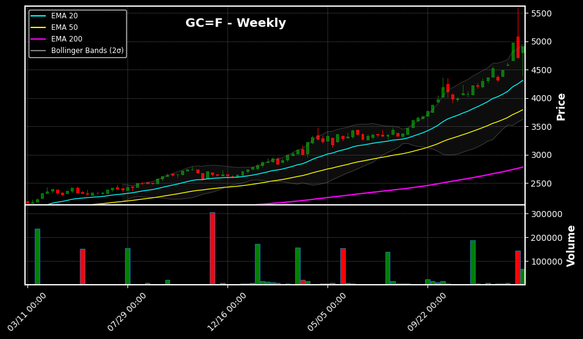
- **Daily**
  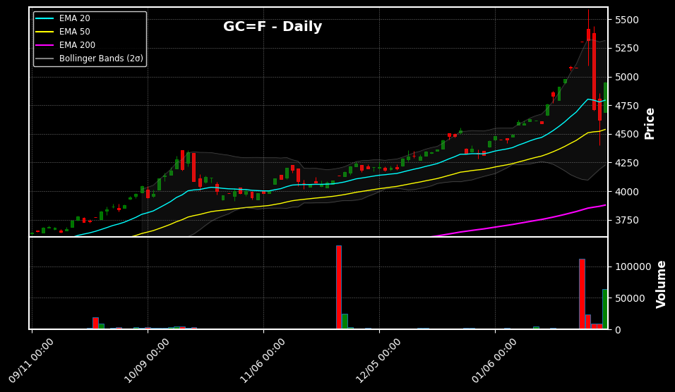
- **4-Hour (4H)**
  
- **1-Hour (1H)**
  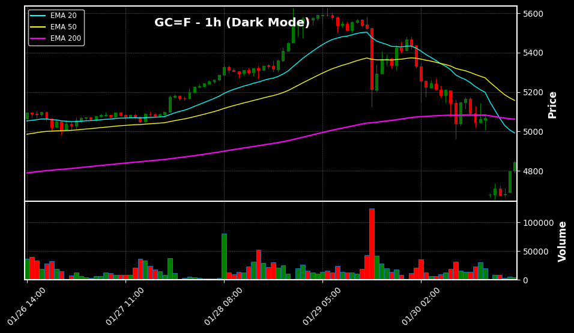
- **15-Minute (15M)**
  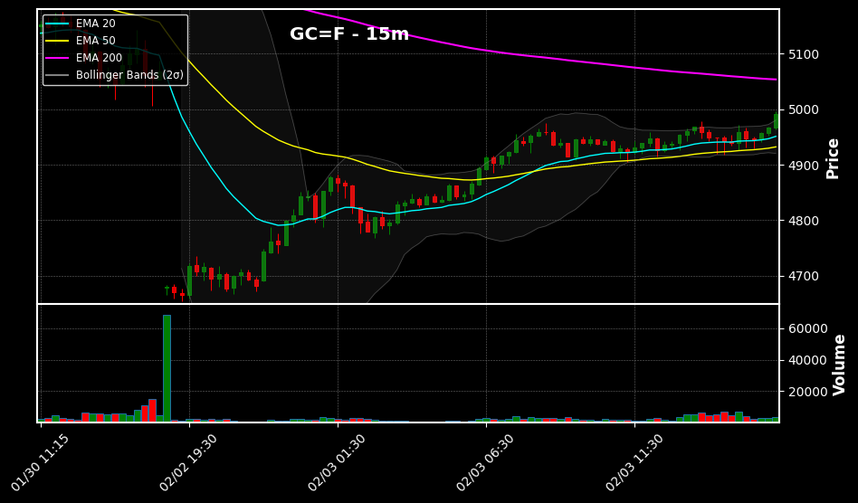

</details>

---

### 2. Crash Acceleration Simulation (`examples/demo-20260130.py`)
Reproduces the historical crash of Jan 30, 2026, detecting the neckline break and the "Great Crash Acceleration" signal.

#### Execution Result (Console Output)
```text
==================================================
 ■ High-Precision Gold Analysis Dashboard
==================================================
【Long Trend:  Neutral / Consolidation
【Momentum:    Strong Downward Pressure
【Volatility:  Stable
【Sentiment】   Neckline Breached (High Risk of Crash)
--------------------------------------------------
 Final Prediction: ⚠️ Great Crash Acceleration
 Risk Level:       EXTREME
 Comment: Key support level broken. Volatility is spiking. Trend bottom is unknown.
==================================================
```

#### Output Charts (6 Timeframes)
<details>
<summary>Click to view all timeframe charts (6 images)</summary>

- **Monthly**
  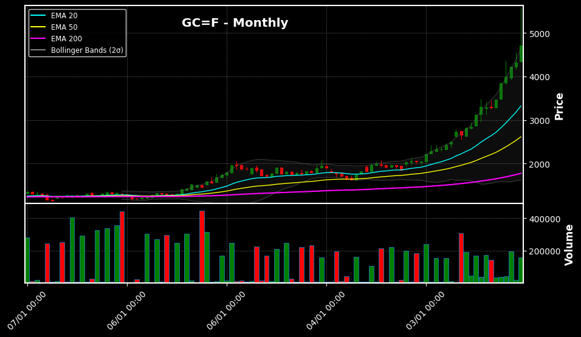
- **Weekly**
  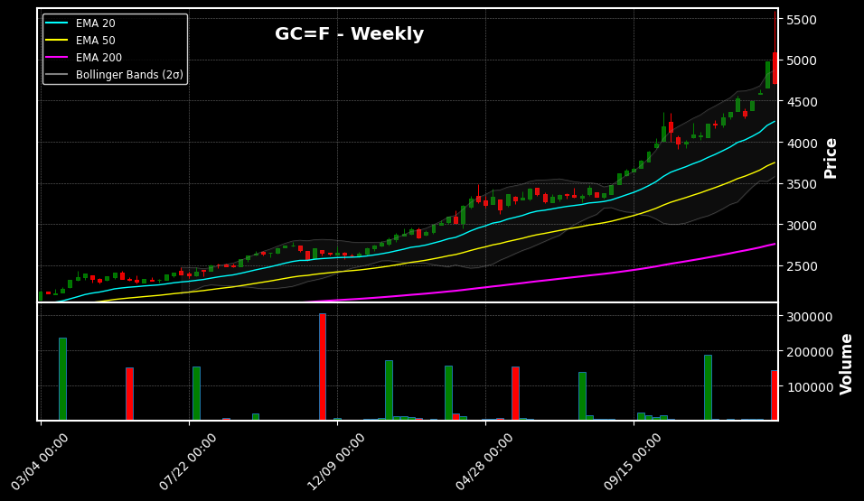
- **Daily**
  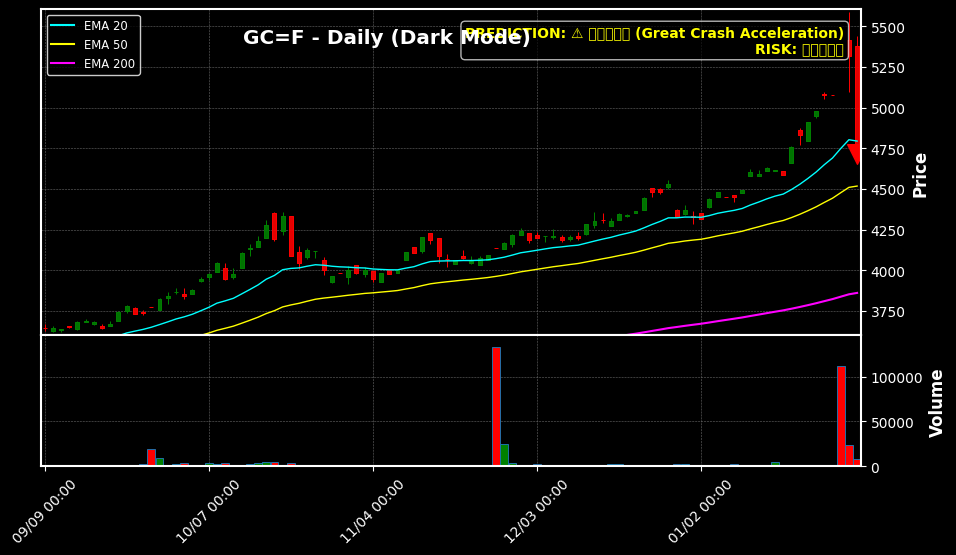
- **4-Hour (4H)**
  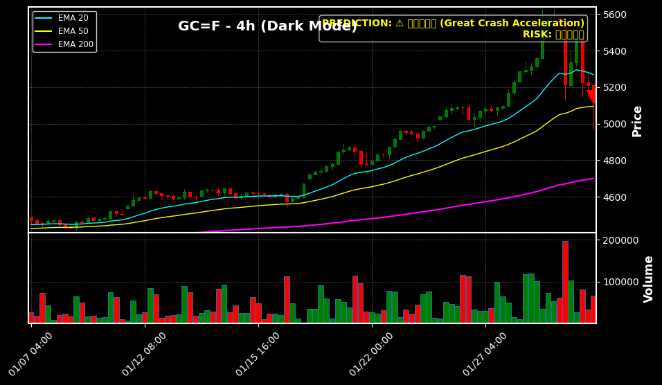
- **1-Hour (1H)**
  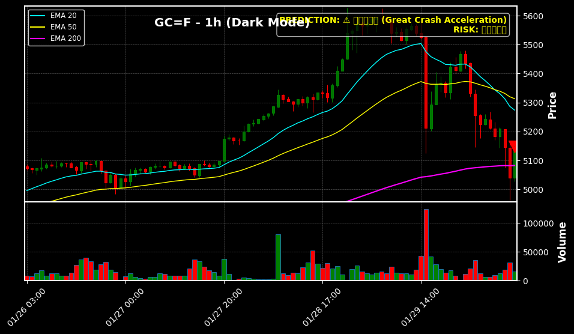
- **15-Minute (15M)**
  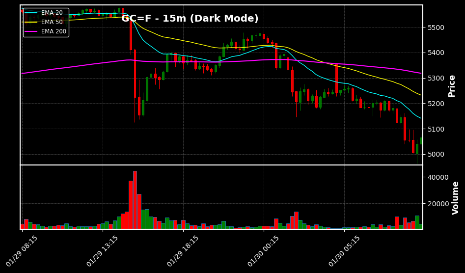

</details>

---

### 3. Bullish Trend Transition Simulation (`examples/demo-20251230.py`)
Reproduces the transition from range-bound to a bullish trend on Dec 30, 2025.

#### Execution Result (Console Output)
```text
==================================================
 ■ High-Precision Gold Analysis Dashboard
==================================================
【Long Trend:  Neutral / Consolidation
【Momentum:    Calm
【Volatility:  Stable
【Sentiment】   Range Bound
--------------------------------------------------
 Final Prediction: Strong Floor / Rebound
 Risk Level:       Low
 Comment: Buying pressure is dominant or a rebound at range bottom is observed.
==================================================
```

#### Output Charts (6 Timeframes)
<details>
<summary>Click to view all timeframe charts (6 images)</summary>

- **Monthly**
  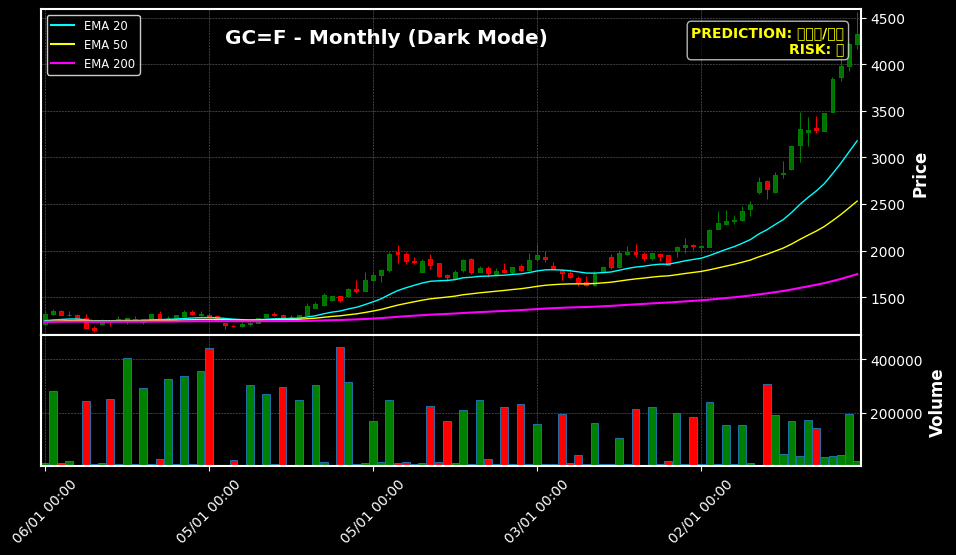
- **Weekly**
  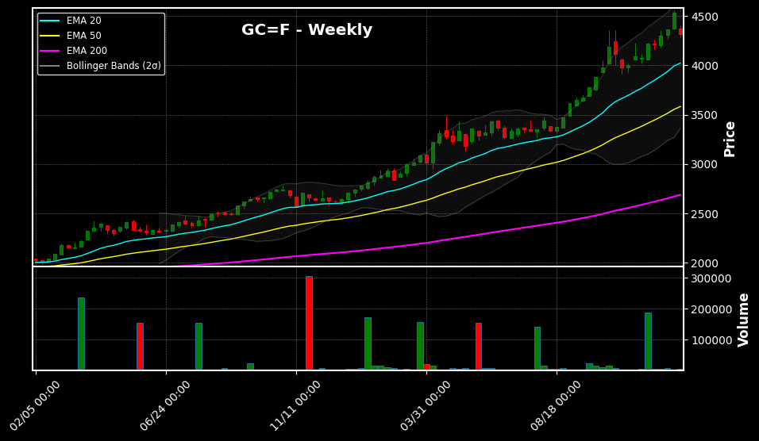
- **Daily**
  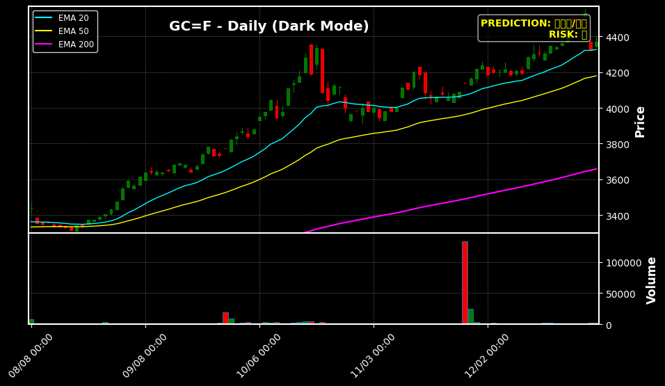
- **4-Hour (4H)**
  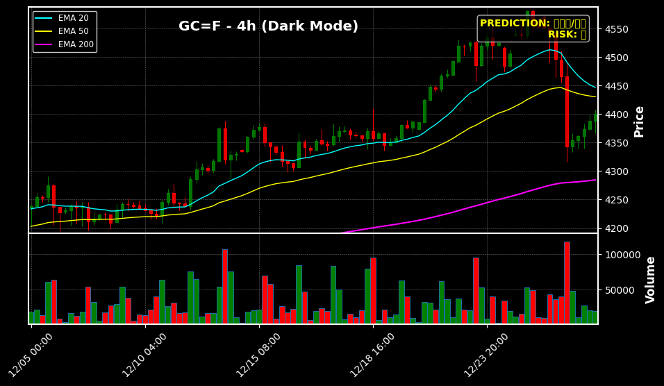
- **1-Hour (1H)**
  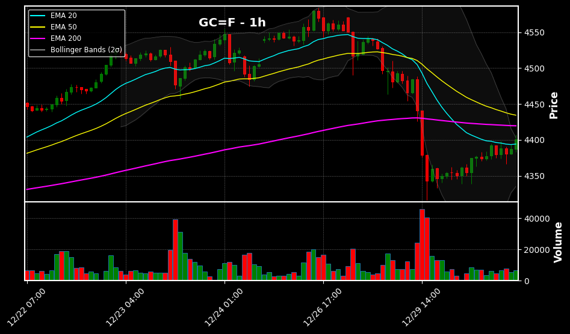
- **15-Minute (15M)**
  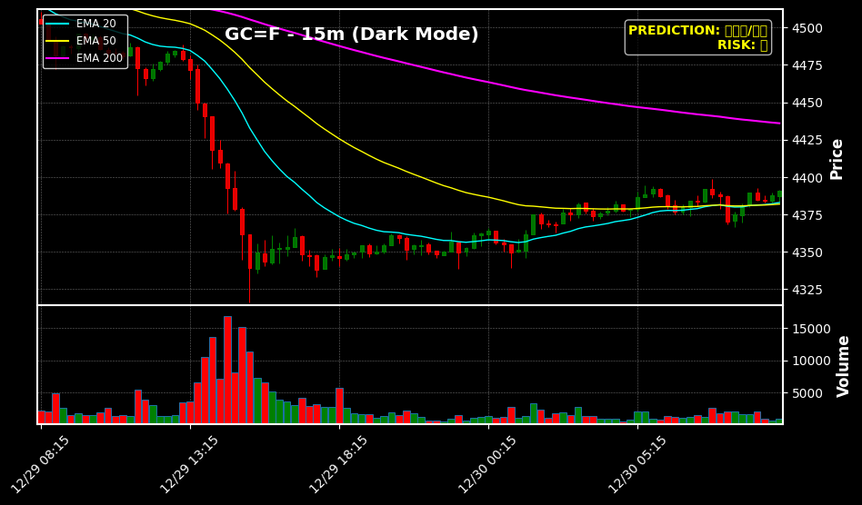

</details>

---

## Project Structure

Detailed descriptions of each file's role in the project.

| Folder | File | Description |
| :--- | :--- | :--- |
| `core/` | [`analyzer.py`](metal_analyzer/core/analyzer.py) | Main `MetalAnalyzer` class. Orchestrates data management, analysis, and plotting. |
| `indicators/` | [`sma.py`](metal_analyzer/indicators/sma.py) | Moving Average (SMA, EMA) calculation algorithms. |
| | [`bollinger_bands.py`](metal_analyzer/indicators/bollinger_bands.py) | Bollinger Bands calculation algorithm. |
| | [`rsi.py`](metal_analyzer/indicators/rsi.py) | Relative Strength Index (RSI) calculation algorithm. |
| `patterns/` | [`double_top.py`](metal_analyzer/patterns/double_top.py) | Double Top (M-Top) detection logic using SciPy filters. |
| `models/` | [`advanced_predictor.py`](metal_analyzer/models/advanced_predictor.py) | High-precision trend prediction engine based on 4 dashboards. |
| | [`top_down.py`](metal_analyzer/models/top_down.py) | Multi-timeframe top-down analysis logic. |
| | [`signal_entry.py`](metal_analyzer/models/signal_entry.py) | Entry and exit signal determination logic. |
| `examples/` | [`demo.py`](examples/demo.py) | Comprehensive analysis demo script using the latest market data. |
| | [`demo-20260130.py`](examples/demo-20260130.py) | Simulation script for the Jan 2026 crash scenario. |
| | [`demo-20251230.py`](examples/demo-20251230.py) | Simulation script for the Dec 2025 trend transition scenario. |
